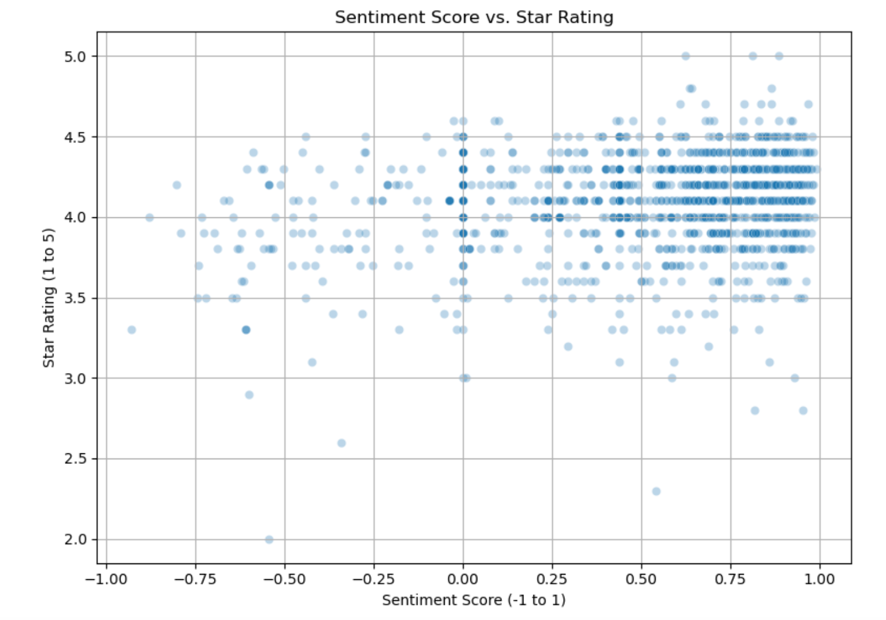

## About Me

Hi, I’m Tania Green — a passionate learner with a love for analysis and problem-solving.

---

## Resume

[Download my resume (PDF)](/files/Tania_Green_Resume_2025.pdf)

---

## Portfolio Projects
### Decoding Customer Sentiment: Analyzing Amazon Reviews Across Product Categories 
Explored the alignment between customer-written Amazon reviews and their corresponding star ratings across various product categories. Utilizing Natural Language Processing (NLP) techniques such as **VADER**, the analysis aimed to determine whether the sentiment expressed in review texts accurately reflects the numerical ratings provided by customers. The anlysis revealed instances where written sentiment did not correspond with the star rating, highlighting the complexity of customer feedback and the potential limitations of relying solely on numerical ratings for product evaluation. 
Relevant tools and techniques: Python, Pearson and Spearman Statitical Correlation Tests, Data Visualization

[Amazon Review Sentiment Analysis](https://github.com/taniagreen03/D502-Capstone)

### Project 2
- [Customer Segmentation with Clustering](https://github.com/taniagreen03/customer-segmentation)

### Project 3
- [Income Prediction Model](https://github.com/taniagreen03/income-prediction)
